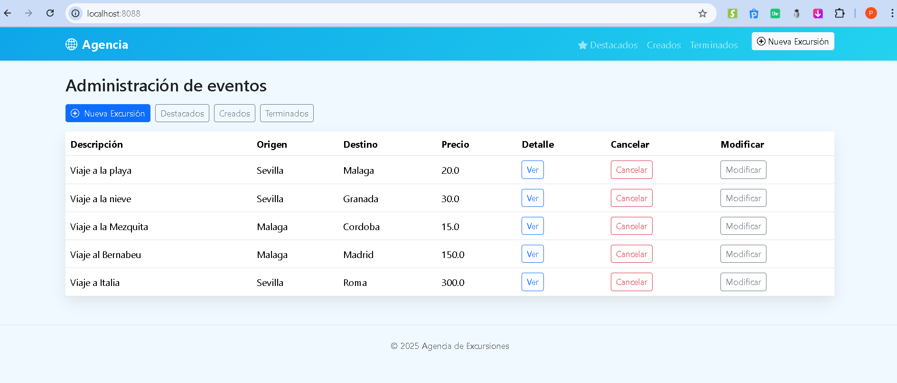
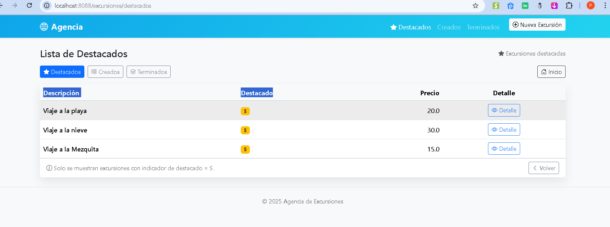
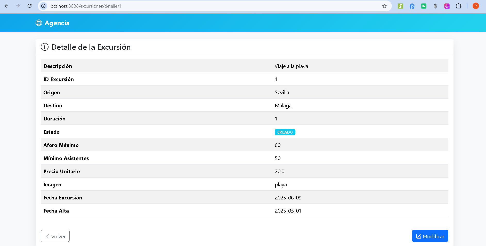
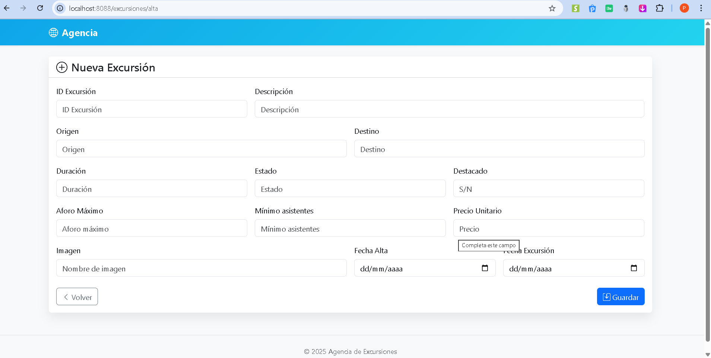

README.md
# Actividad1_PFG

Aplicación **Spring Boot 3.3.4 (Java 21)** con **Thymeleaf**.  
CRUD simple usando **listas en memoria** (sin base de datos).

## 🚀 Tecnologías
- Java 21
- Spring Boot 3.3.4
- Thymeleaf
- Maven

## ▶️ Cómo ejecutar
```bash
mvn spring-boot:run
# o
./mvnw spring-boot:run

## 🖼️ Capturas de la aplicación

### Menú principal


### Excursiones destacadas


### Detalle de excursión


### Crear nueva excursión


